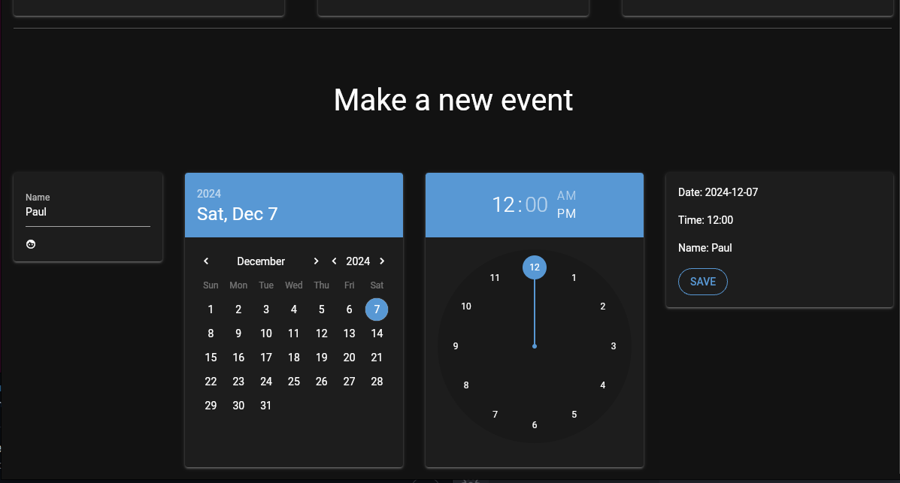

# Countdown-App
This is a simple Countdown app made using nicegui that will take dates in the format YYYY-MM-DD. This can be done either throught the GUI or a command line script.

## How to use
To use the actual countdown. All you have to do is run `python3 Countdown.py`. This repository comes with some basic events to display and show how it works.

To use the script - From the root of this folder run `python3 scripts/add_event.py --date YYYY-MM-DD --time HH:MM --name (whatever you want)`

## Functionality
From the GUI you will be able to make a new event and see a count down to your closest event (NOTE: This is not a live countdown it is taken from when you run the app.)

Below you can see hte basic design of the countdown. From this you can see the closet event which includes hours and a list of events that are stored in the file. The calendar will show a range of dates however due to this being on the same day it will not display.

Below is the desing for adding an event to the file. This uses a text input time selector and date selector. This will then run code to conver to the needed format allowing the user to have a easy experience using the app.

## Current Bugs
- Currently the program will not update once you add a new event so you will need to restart the application to have those update.
- The calendar does not display anything if the event is within the same day.

## Future Plans
- Bug fixes
- Add ability to remove events
- Option to remove events that have past
- Mulitple pages instead of one
- A live countdown that will update
- Update after adding event
